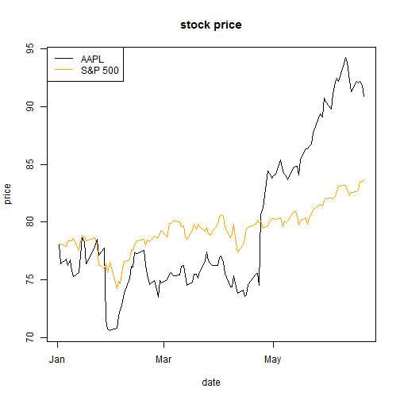
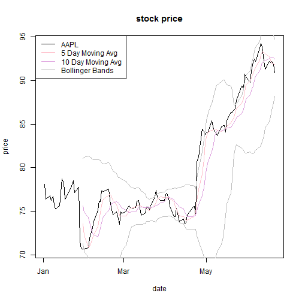

## Why we need it?
1. investors need a quick and straightforward access to the individual stock prices, comparison with the market, and its technical indicators, to make investment decisions;
2. from the app, investors could get the latest stock price, or all the listed companies, with all the scaled major indices, and all the calculated technical indicators, in just one second! 

Should I invest on Apple, Google, Amazon, Microsoft or Facebook? Let's try and see!

--- 
## How to use it?
1. Investors may simply enter a ticker in the text box, select a period and submit, you will see the daily stock price and trading volumne plots of the specified ticker, period. The default ticker in the app is AAPL (Apple), and default period is 2014-01-01 to 2014-06-30. 
Notice the plots are based on the adjusted close price, so the stock splits have been taken care of;
2. Investors may click on one of the major indices, to add its plot to the security plot and make a comparison. Notice the index is scaled to start from the same value as the security, in order for investors to have a straight-forward vision of whether the security is outperforming the market; 
3. Investors may choose any of the technical overlays, to add their plots to the security plot and make a investment decision. As the Moving Averages and Bollinger Bands are calculated on trailing prices averages, their plots are some days lagged from the starting point. The interaction between the security price itself and its technical overlays shows the possible future trend; 
4. The daily trading volume plot is added below the main chart as well, as it is one of the most important information; 

---
### Take AAPL for example I - with index overlays
#### "Looks like in this half year Apple outperformed the market a lot!"
 

---
### Take AAPL for example II - with technical overlays
#### "It is still in its moving up range, and so worth investing!"
 

